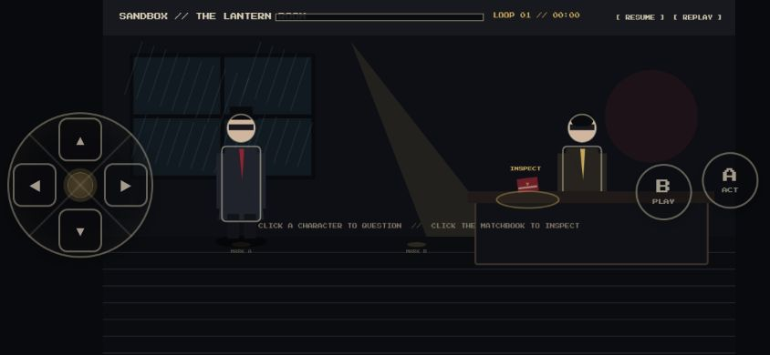
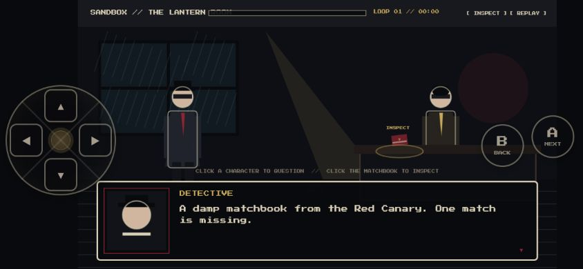
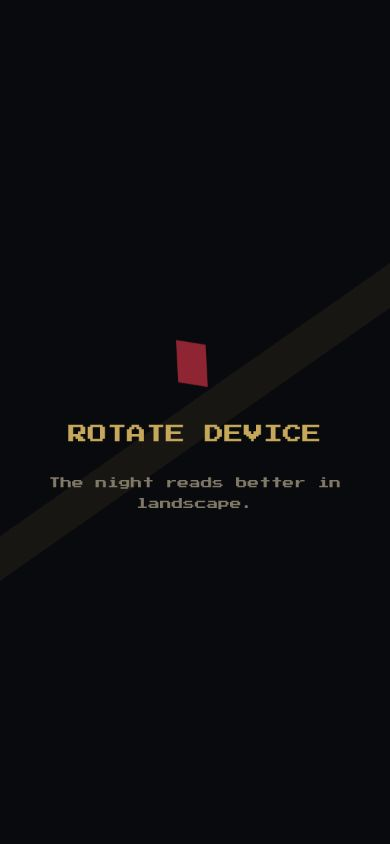

# Mobile Sandbox Screenshot QA

Captured: 2026-07-11  
Scene: `sandbox` / Lantern Room  
Renderer: Phaser 4.2.1 WebGL

## Capture poses

### Landscape controls

- Viewport: 844x390
- Named pose: `mobile-controls`
- Timeline: loop 1, paused at 0 ms
- Focus: matchbook
- Expected labels: A / ACT and B / PLAY
- Result: Pass

The 160px circular D-pad and 62px circular action buttons remain inside the
viewport, preserve the lightly transparent treatment, and do not cover either
character or the focused clue. Each directional hit region remains 48x48px.
The dim-yellow reticle is visible beneath the matchbook and does not rely on
color alone because it adds a distinct oval and pointer shape.

### Landscape dialogue

- Viewport: 844x390
- Named pose: `mobile-dialogue`
- Timeline: loop 1, paused at 0 ms
- Dialogue: `sandbox-matchbook`, page 1
- Expected labels: A / NEXT and B / BACK
- Result: Pass

The portrait, speaker, two-line body copy, and advance marker remain readable.
The D-pad and action buttons stay visible without covering dialogue content.
The focused clue remains identifiable behind the panel.

### Portrait orientation

- Viewport: 390x844
- Gameplay controls: hidden
- Rotate-device presentation: visible
- Result: Pass

The orientation instruction is centered, high contrast, and visually consistent
with the noir palette. Gameplay and translucent controls are not visible behind
the presentation.

## Review summary

- Scale: Pass. Characters remain full-body and readable at landscape phone size.
- HUD: Pass. No controls, debug labels, portrait, or dialogue text overlap.
- Input state: Pass. Focus, pause, inspect, next, and back states match labels.
- Camera: Pass. The fixed 16:9 stage fits vertically with expected side gutters.
- Assets: Pass. Placeholder faces and silhouettes render without broken textures.
- Browser errors: None during final capture route.
- Blocking defects: None.

Each PNG has a companion `.layout.json` exported from runtime DOM and canvas
coordinates. Machine reports and annotated 10% grid images are stored under
[`docs/qa/2026-07-11-circular-mobile-controls/`](../../qa/2026-07-11-circular-mobile-controls/).

The top sandbox timeline labels are intentionally small debug UI and are not a
production HUD approval. Reassess their size when the player-facing timeline is
designed.
